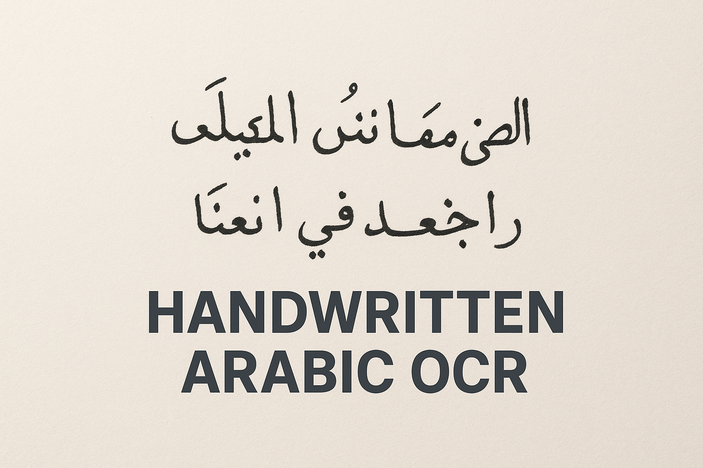

  

# Arabic Optical Character Recognition
This work aims to build a powerful Arabic OCR system ✨ that uses cutting-edge open-source transformer models 🤖. The system reads and converts Arabic text from:

📄 Scanned pages

✍️ Handwritten manuscripts

🖨️ Printed documents

Using a modern vision-to-text architecture, it achieves accurate transcription even with different fonts, noisy scans, and complex page layouts. 🔤🧠💡

### Document Background Removal:
Scanned documents are converted to grayscale, and the background is removed using thresholding while noise is cleaned up. Broken or thin text strokes are filled, producing a clean black-and-white image ready for OCR.

📄 → 🎨 → ✂️ → 🧹 → 🖋 → ✅

Document → Grayscale → Background Removal → Noise Cleanup → Text Fill → Clean Document
